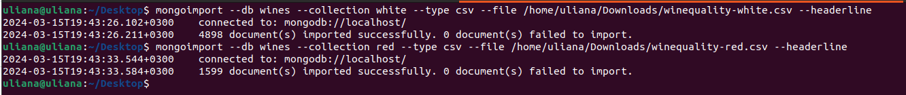
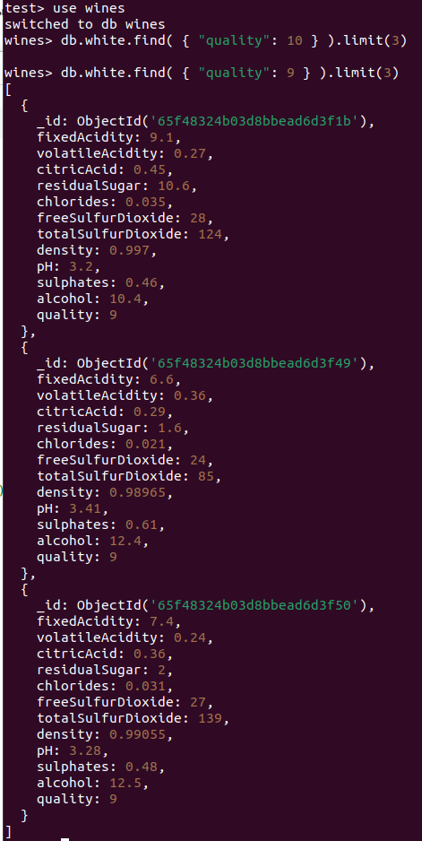
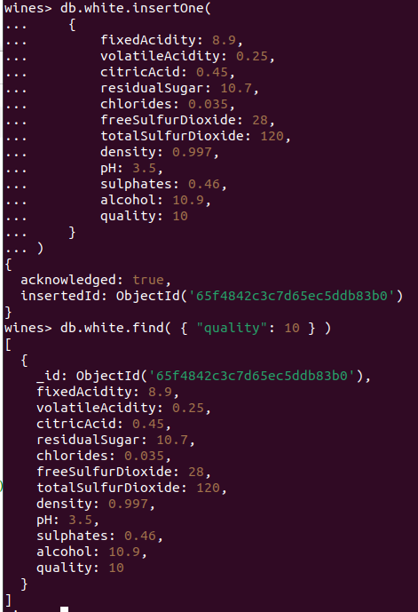
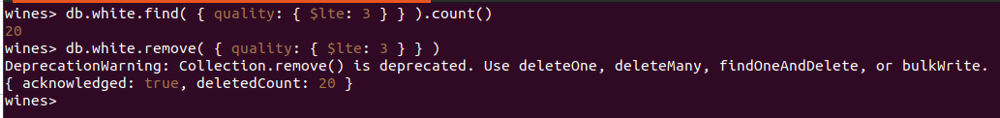
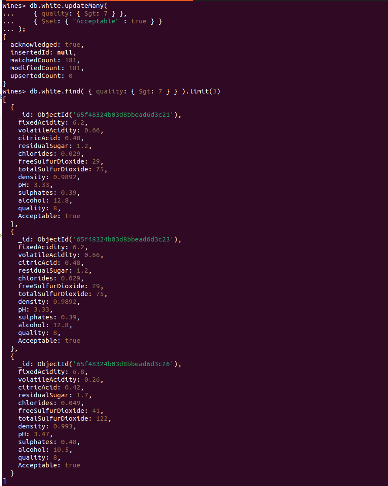
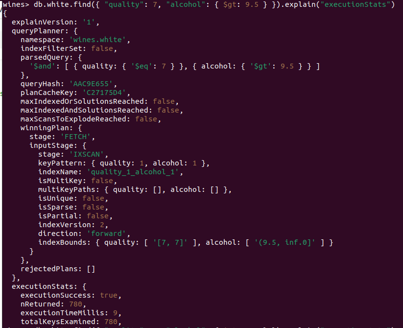
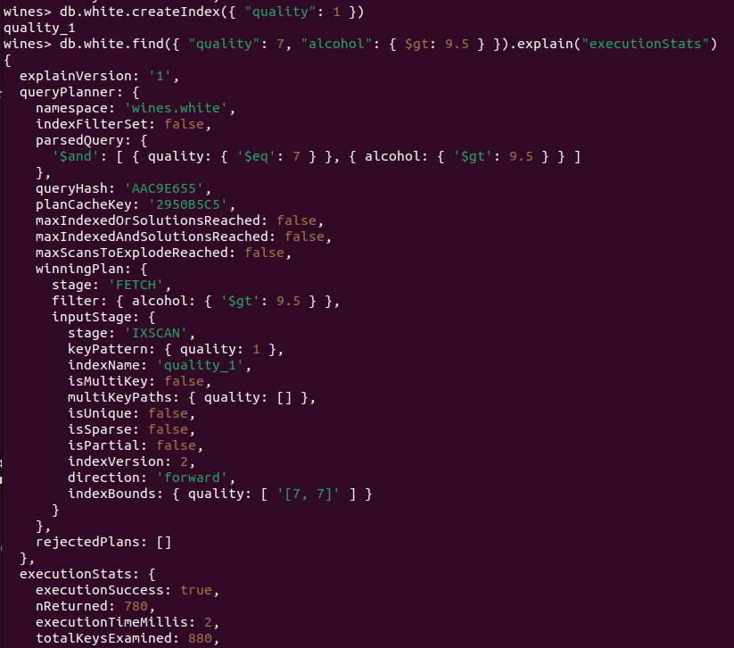

## Отчёт по взаимодействию с MongoDB
Вся справочная информация черпалась из воистину подробной [документации](https://www.mongodb.com/docs/manual/).
1. Сначала я поставила **MongoDB Community Edition** на локальную машину, которая в моём случае представляет из себя Ubuntu 22.04 LTS:
 
   
   
   
2. Запустила:

   
   
3. Затем я выбрала датасет: остановилась на [этом варианте](https://archive.ics.uci.edu/dataset/186/wine+quality), содержащем хакрактеристики вин. Чуть поправила csv файл, чтобы жилось легче (переименовала поля так, чтобы они были однословными, а не составными как в оригинале). Загрузила две коллекции (белые вина и красные) с помощью `mongoimport` в бд:

   
   
4. Далее я решила посмотреть, а сколько вообще вин в коллекции `white` имеет **quality** равный 10-ти (максимальное значение). Оказалось - нисколько. Ну хотя бы со значение 9 нашлись:
   
   
   
5. Добавила новое, идеальное (с **quality** = 10) вино в коллекцию:
   
   

6. Удалила из коллекции все вина с **quality** <= 3 (зачем нам эта посредственность...):

   

7. А для всех вин с **quality** > 7 добавила флаг **Acceptable = true**:

   

8. Задалась вопросом, сколько времени потребуется, чтобы выполнить запрос `db.white.find({ "quality": 7, "alcohol": { $gt: 9.5 } })` и с помощью  `executionStats` получила ответ - **9 миллисекунд**:

  

9. При этом если создать индекс по **quality**, то время снизилось аж до **2 миллисекунд**:

  

10. Составной индекс я делать не стала, потому что датасет, в общем-то, небольшой, но в случае с данными больших объёмов, это могло бы дать ещё больший буст в скорости поиска.

Как итог, MongoDB показалась очень приятной в использовании (во многом благодаря документации). Думала, что из-за того, что она является не реляционной, будет чуть сложнее освоиться, но по крайней мере на базовом уровне никаких сложностей не возникло. Экспириенс 10/10, всем советую.
