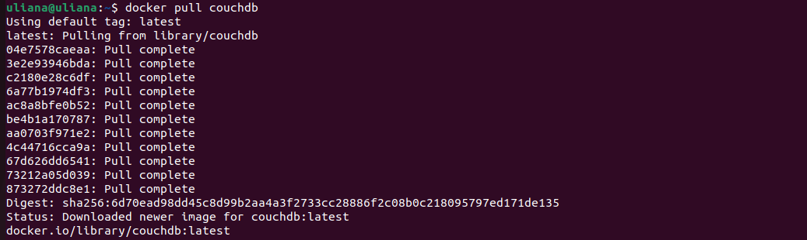
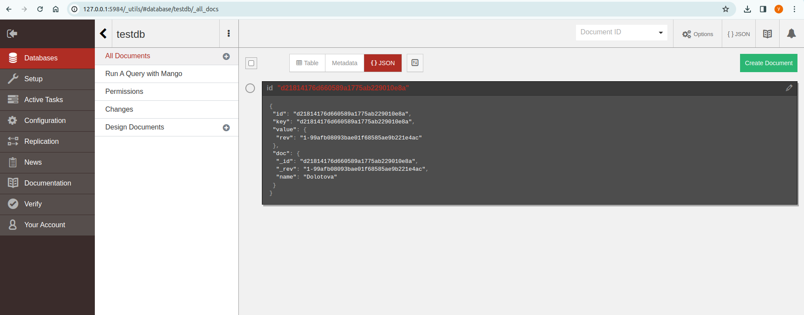
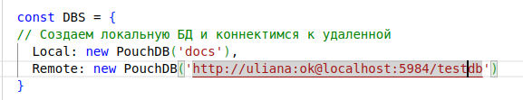
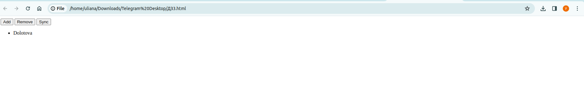

1. Загружаем образ CouchDB:

2. Запускаем контейнер с CouchDB. Создаём нашу бд и добавляем документ с полем "name" и фамилией:

3. Прописываем в ДЗ3.html путь к нашей инсталляции CouchDB:

4. Запускаем `ДЗ3.html`, нажимаем на `sync` и фамилия действительно оказывается на экране:

5. Останавливаем контейнер. Обновляем `ДЗ3.html`. Фамилия всё так же фигурирует на экране.

Файл `html` с прочитанной фамилией [тут](PouchDB.html)
